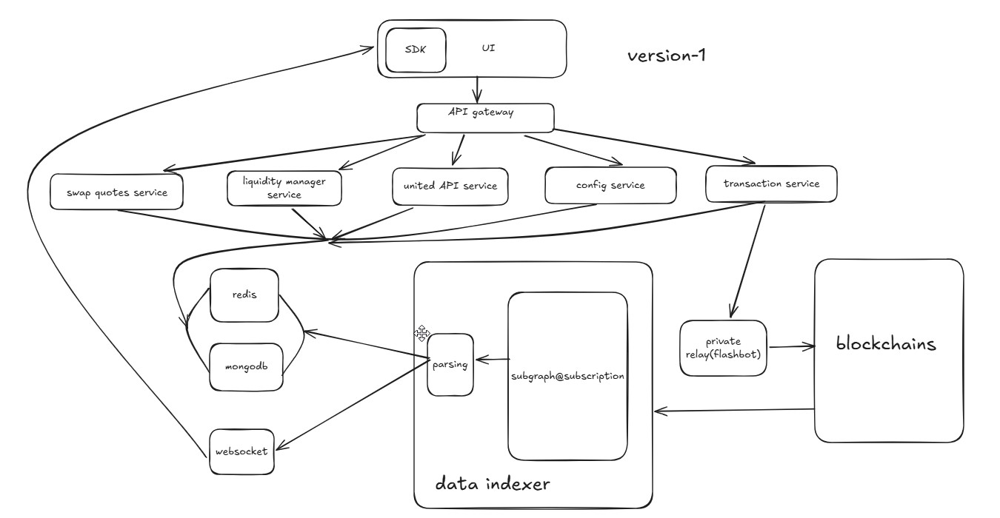
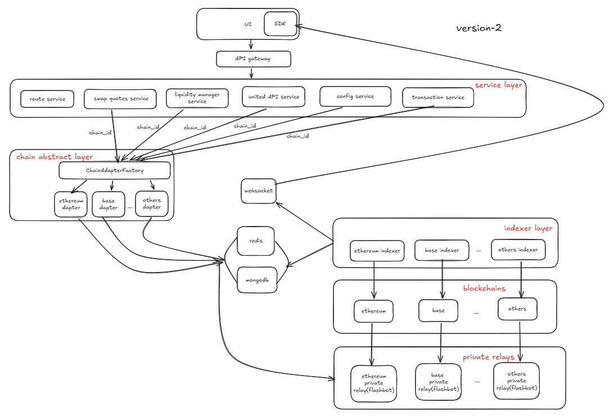
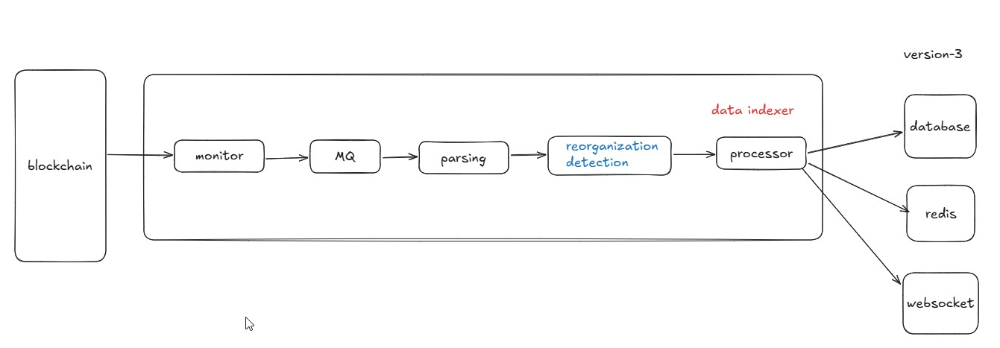

# About the project
This is a production‑ready decentralized exchange developed from scratch and deployed independently. Core features include:  
    - **Swaps**: Integrated with Uniswap V3 Router, supporting exact input/output swaps.  
    - **Liquidity Management**: Add/remove liquidity, collect fees, query positions. The liquidity addition process involves real‑time pool data fetching and rendering of price range selectors, with dynamic calculations for position ticks and liquidity amounts.  
    - **Real‑Time Data**: Backend polls pool data via The Graph and pushes updates to the frontend through WebSocket, avoiding RPC overload.  

**Tech Stack**: Next.js, TypeScript, Tailwind, Wagmi, Express, MongoDB, Hardhat, Solidity  
**Deployment**: Independent domain, fully tested on testnet, stable operation  
**Code**: 100% hand‑written, no template forks  

**Website**: https://app.bestdex-by-janessatech.com

# 1 min demo:
# Architecture Evolution Roadmap& Product Timeline
This project is divied into 4 stages:  
| Stage   |  Timeline  | Focus | Owner | Status |
| -------|------------| ------| ------| -------|
|**Stage0**|July 1st, 2025 - Jan 1st, 2026| Implement MVP core functionalities| JanessaTech| Done |
|**Stage1**|March 1st, 2026 - Dec 31st, 2026| Deploy the production as miroservices, enhance RPC performance, user experiences and security|JanessaTech| In progress |
|**Stage2**|TBD|Support abstract chain| TBD| TDB|
|**Stage3**|TBD|Implement a self-developed data indexing pipeline to handle chain reorganization.| TBD| TDB|

## Stage0: MVP

For the detais of the design, please check the following documents:  
- [How to design a scalable backend for DEX](./interviews/[1]%20How%20to%20design%20a%20scalable%20backend%20for%20DEX.md)
- [How to design a highly available real-time system for the liquidity management of DEX](./interviews/[2]%20How%20to%20design%20a%20highly%20available%20real-time%20system%20for%20the%20liquidity%20management%20of%20DEX.md)

## Stage1: Enhance RPC performance, user experiences and security

For the detais of the design, please check the following documents:
- [How to optimize the interaction(via rpc calls) bewteen the frontend and blockchain to enhance the user experience and stability](./interviews/[4]%20How%20to%20optimize%20the%20interaction(via%20rpc%20calls)%20bewteen%20the%20frontend%20and%20blockchain%20to%20enhance%20the%20user%20experience%20and%20stability.md)
- [How the data flows from the frontend to blockchain when a user starts a swap transaction](./interviews/[5]%20How%20the%20data%20flows%20from%20the%20frontend%20to%20blockchain%20when%20a%20user%20starts%20a%20swap%20transaction.md)
- [How does your DEX prevent the front-running and provide](./interviews/[6]%20How%20does%20your%20DEX%20prevent%20the%20front-running%20and%20provide.md)
## Stage2: Support abstract chain 

For the detais of the design, please check the following documents:
- [How to design a DEX which supports multiple chains(ethereum, Polygon, Arbitrum etc)](./interviews/[7]%20How%20to%20design%20a%20DEX%20which%20supports%20multiple%20chains(ethereum,%20Polygon,%20Arbitrum%20etc).md)
## Stage3: Handle chain reorganization

For the detais of the design, please check the following documents:
- [How to design a system which can efficiently and accurately index and store data in chain(transactions and events)](./interviews/[3]%20How%20to%20design%20a%20system%20which%20can%20efficiently%20and%20accurately%20index%20and%20store%20data%20in%20chain(transactions%20and%20events).md)
