## About this project
This project is a Trade Crypto on Defi Dapp with the Uniswap v3 protocal as the technical fundamental to exchange Crypto token pairs and mine liquidity.

It has the following main features:
1. Swap two token pairs
2. Create/increase/remove liquidity
3. Collect fee

The highlight of the project:
TBD

## How does the Dapp work
Before doing any operations below, make sure that you've had enough tokens in charge
I'll use the testnet **Ethereum Sepolia** as the example to show you how it works
### Login
Click the **Collect Wallet** button on the right top page. A page will pop up with serveral wallets options you can choose from. Here I will use **MetaMask** to login
 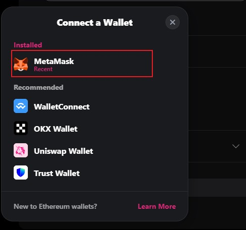
A new dialog will pop up after you clicked **MetaMask**, asking you to connect MetaMask
 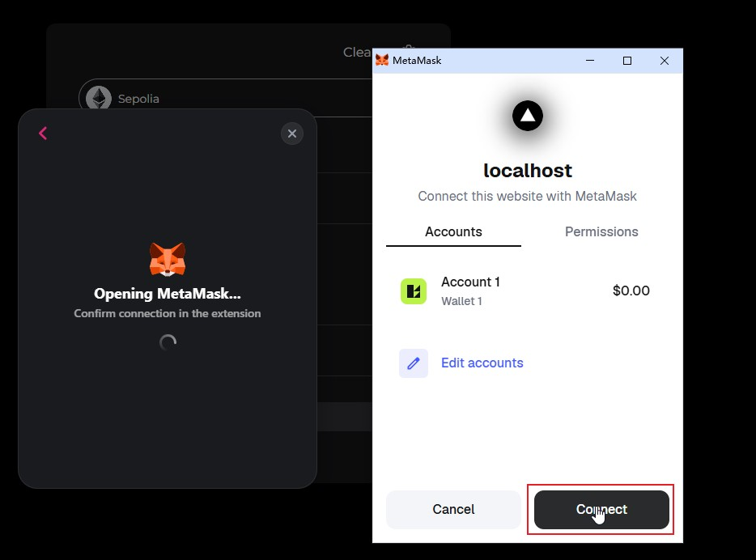
Click **Connect** button, you will be asked to verify your account. Click **Confirm** to sign in
 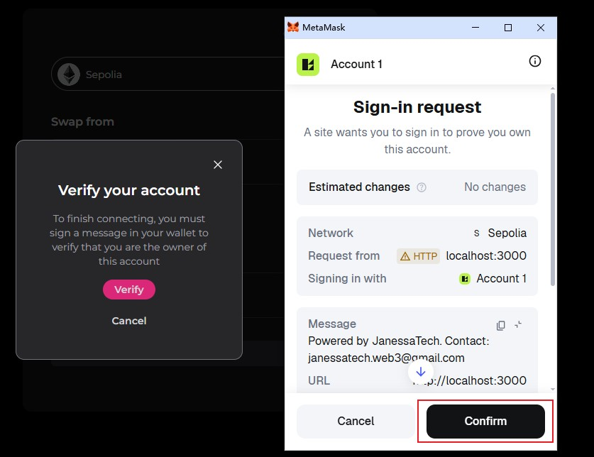
### Swap two token pairs
Once you logined successfully, choose **Swap** on the menu.
Choose **Sepolia**.  Choose **WETH** for the first token and **USDC** for the second token, input the amount of the first token you want to swap and click **Get Quotes**
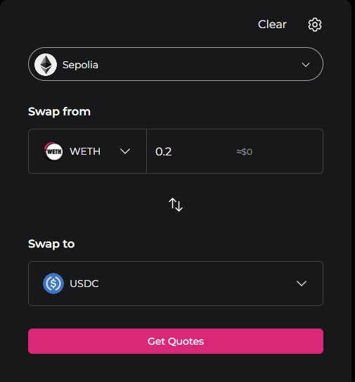
You need to wait for a few seconds for the **Quotes** to be ready
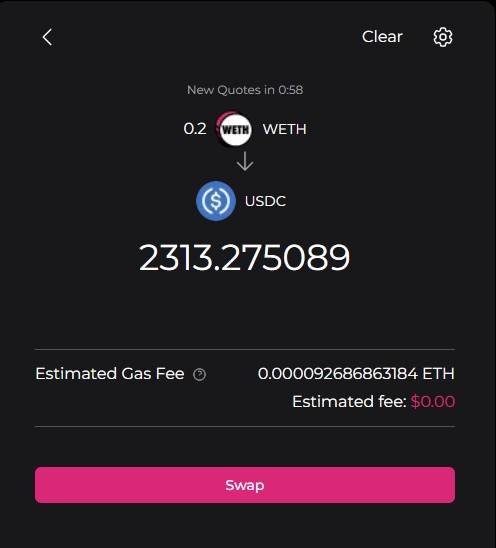
Click **Swap** button.
Input the amount of tokens you need to approve for the swapping. The default value provided by default is usually enough. Then click **Approve and swap**
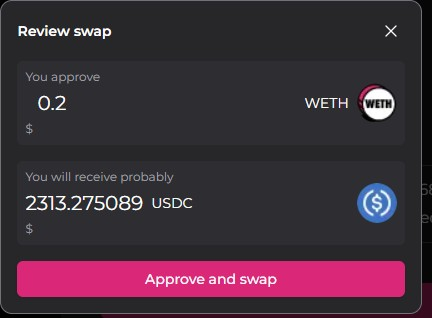
In the proccess of swapping, you will have 1 approval, 1 simulation and 1 real swapping.
The approval. Please click **Confirm**.After that, a simuation is executed for the safety of the swapping.
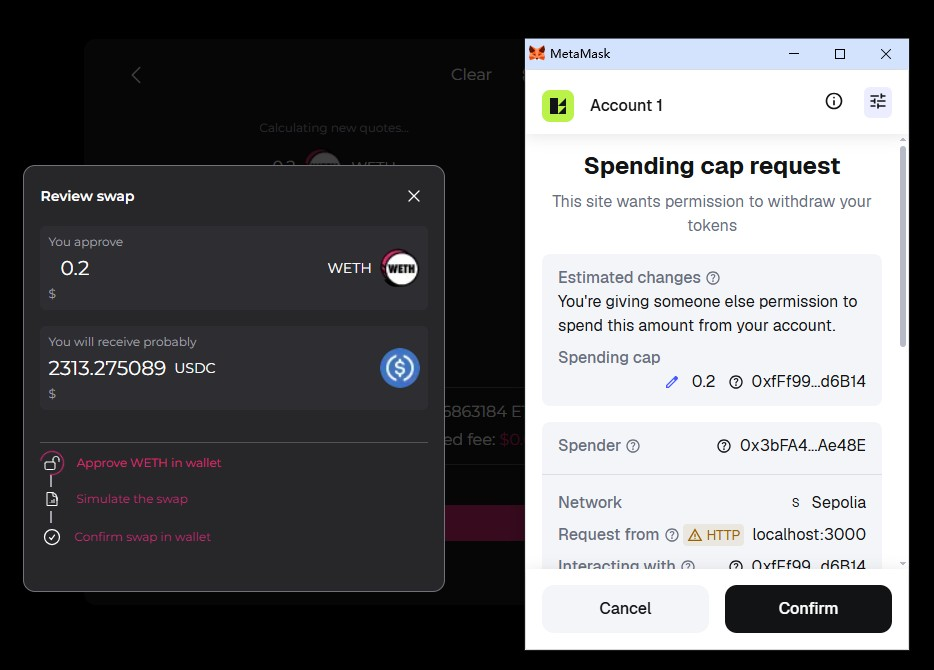
If the simulation is passed, it will start swapping. Click **Confirm** to make the swapping finish
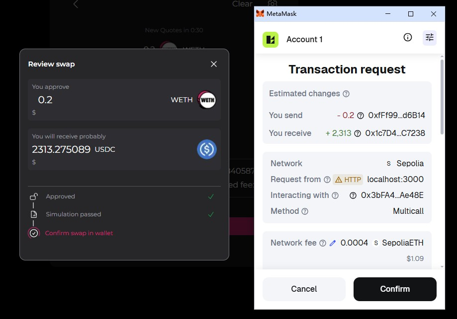
Once the swapping is successful, it shows us how much target token we will get
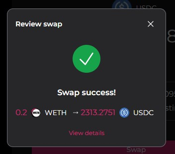
Go to **Explore -> Transactions** page, you will a record of the swapping you just finished
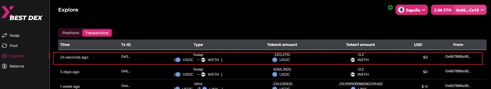
### Add positions(Create liquidity)
Adding position is the most complex operation.
Go to **Pool** menu, choose a pair of token you want to invest. In this example, I choose **USDC** and **WETH** as the token pair and the fee tier is **0.3%**. Then click **Next**
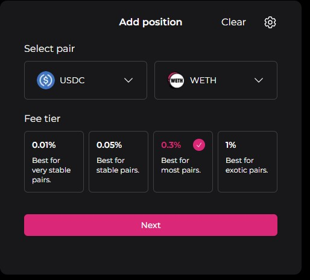
This page looks complicated. No worries. This page is to let you choose the lower&upper range of your position you will create. You could use two vertical lines to move left/right to adjust lower&upper boundary. Then click **Add position**
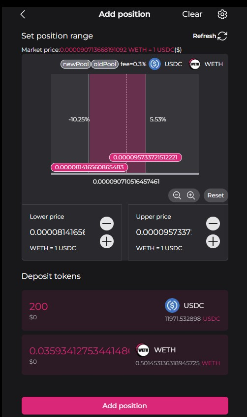
In this page, it will start the process of adding position. Typically, the process will include 1-2 approvals, 1 simuation and 1 adding operation. Except the simuation, you need to interact with wallet to make the process move on. In this case, it has 2 approvals.
Click **Confirm** for the first approval
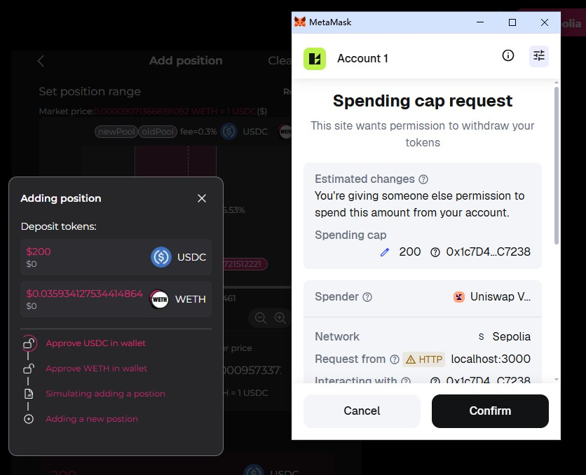
Click **Confirm** for the second approval
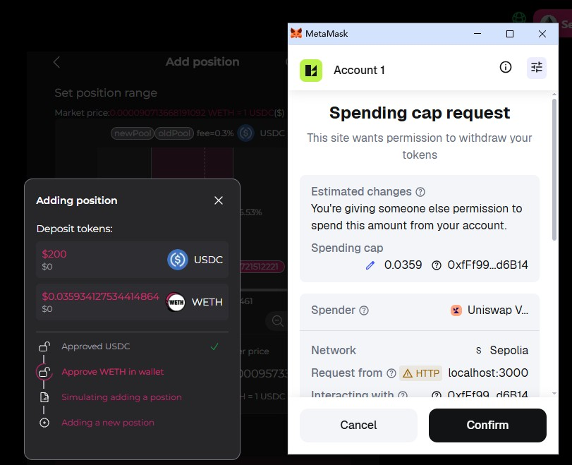
Once the simuation is passed, it starts adding position. You need to click **Confirm** to make the process move on
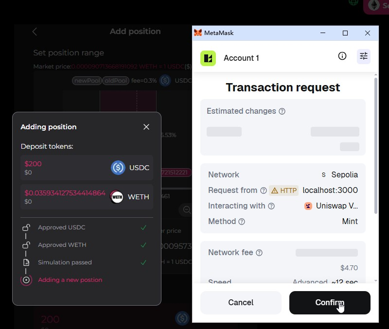
This page shows us how much tokens are deposited
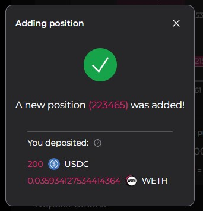
Go to **Explore -> Transactions** page, you will a record of the adding position you just finished
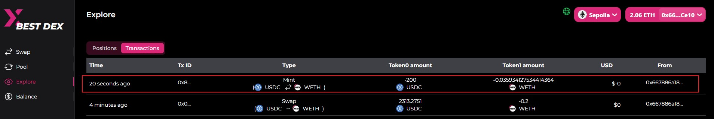
Go to **Explore -> Positions** page, you will a record of position you just created
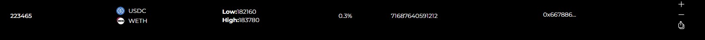
### Increase liquidity

### Decrease liquidity
### Collect fee


## Installed dependences

```
npx shadcn@latest init
npm install @uniswap/sdk-core @uniswap/smart-order-router @uniswap/v3-sdk
npm install @rainbow-me/rainbowkit
npm install siwe
npm install lodash.merge
npm i --save-dev @types/lodash.merge
npx shadcn@latest add button
npx shadcn@latest add command
npx shadcn@latest add popover
npx shadcn@latest add sonner
npx shadcn@latest add table
npx shadcn@latest add tabs
npx shadcn@latest add tooltip

```

## How to start

```
npm run dev
npm run build
npm run start
```


## Follwing-up: enhancements
1. Integrate Uniswap Permit2 to enhance user experience
2. Read price from backend - [Done]
3. websocket to monitor pool in backend - [Done]
    - 3.1 check bugs for websockets
    - 3.2 do performance tests
4. Speed up quotes in backend
5. flashbot
6. add logger for frontend - [Done]
7. Add curd for postions - [Done]
8. Refactor tokenList - [Done]
9. fix bugs:
    6.1 exception when create a new position - [Done]
10. Add UTs for frontend and backend
11. using Todo as the keyword to search the places which we should do the enhancements on
12. Move logTransaction to backend (In future, must make sure the websocket service is robust)
13. Add authentication and authorization
14. config channels in backend instead of hardcode
15. merge configuration(UNISWAP_V3_FACTORY_ADDRESSES, V3_SWAP_ROUTER_ADDRESS, NONFUNGIBLE_POSITION_MANAGER_CONTRACT_ADDRESS, chainUrls) with backend and put them into backend
16. Support the native token both for swap and position ops
